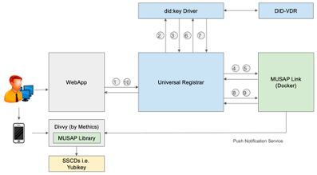

# Divvy (Android)
Divvy is a custom built app using [MUSAP Android Library](https://github.com/methics/musap-android). Divvy can be used to integrate a server-side application to YubiKey and other SSCDs. 

Divvy is currently used in a two way collaboration between [Client-DIDS](https://github.com/NGI-TRUSTCHAIN/CLIENT-DIDS) and [MUSAP Project](https://github.com/NGI-TRUSTCHAIN/MUSAP_project/). 

   



## Features

1. Signing with Yubikey
2. EdDSA Signatures
3. Push notification support

## Getting Started

Import the project with Android Studio:

```File -> New -> Project from Version Control...```
